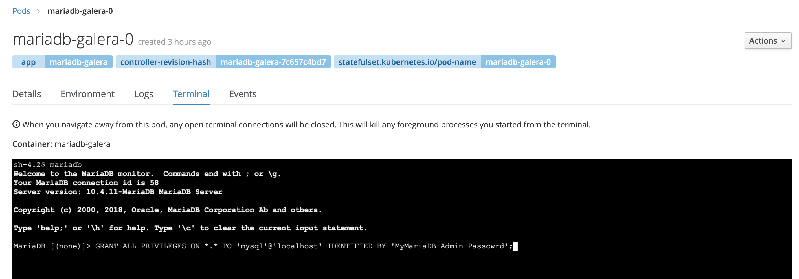

### Accessing and Setting Up Your New Galera Cluster:

Now that we have a running, three node MariaDB cluster...  Let's make something useful out of it.

I use a free tool called `DBeaver` to manage databases from my MacBook.  Take a look at it [here](https://dbeaver.io).

1. We need to access the running MariaDB instance through a command line so that we can setup password access over port 3306.  We will do this through the OpenShift console.  In the console, navigate to your `mariadb-galera` project and get the list of running pods.

    

1. Now, select the mariadb-galera-0 pod.  We'll open a terminal into this pod.

    

1. Select the `terminal` tab.  You will see a command prompt.

    

1. From the command line, connect to mariadb and grant access to the `mysql` user from `localhost`.

    

OK, we have connected to our new MariaDB cluster by directly accessing the terminal from one of the PODs.  Not particularly useful, right?

So, let's make it a bit more useful, and connect to it with DBeaver.

1. Note that we do not have any means to connect to the MariaDB cluster from outside of OpenShift.  In fact, we can't even connect to it from outside of the `mariadb-galera` namespace.  This is by design.  Unless you REALLY need external applications to connect to this database, do NOT create a `route` that exposes port `3306` outside of the OpenShift cluster.  Instead, we can make this MariaDB cluster available for connection to applications deployed in OpenShift by either making the `mariadb-galera` namespace globally accessible with the OKD cluster, or we can connect specific namespace networks together.

        oc adm pod-network join-projects --to=mariadb-galera my-application-namespace

1. However, this still does not enable me to externally manage the MariaDB cluster.  And... as much as I love the command line, I really don't relish the idea of connecting to a pod terminal every time I need to do something.  I sure can't use that method to import data...  Enter the `port-forward` capability of OpenShift.  Using `port-forward` I can temporarily expose a port from a POD to my local workstation as though it were a local port.

        oc port-forward mariadb-galera-0 3306 -n mariadb-galera

    I can now connect a database management tool like DBeaver to the locally exposed port.

1. Assuming that you have already installed DBeaver, launch it and create a new connection to port `3306` on `localhost` use the `mysql` user with the password that you set above.

    

1. You are now connected to your MariaDB cluster!

    

When you are done managing your database, simply terminate the `oc port-forward` command.  

__Note: Your load balancer may terminate your `port-forward` command after a period of inactivity.__

The last thing to discuss, is how to properly shutdown and start up your MariaDB cluster.  The proper procedure is to use `oc scale` to bring it up and down.

1. To gracefully shutdown your cluster:

        oc scale statefulsets mariadb-galera --replicas=0 -n mariadb-galera

1. To gracefully start it back up:

        oc scale statefulsets mariadb-galera --replicas=3 -n mariadb-galera
    __Note: If you originally had 3 PODs running, then you want to restart with 3 PODs.__  If you scale with less than you had previously, your cluster will run, but will not have the same scalability or redundancy.  If you scale up more than you previously had running, do so with intent.  Because you will be adding nodes to your cluster and consuming more storage.  Remember, every node is a complete copy of the database.  There is probably little reason to run more than three replicas.

Have fun with your new MariaDB Galera cluster!